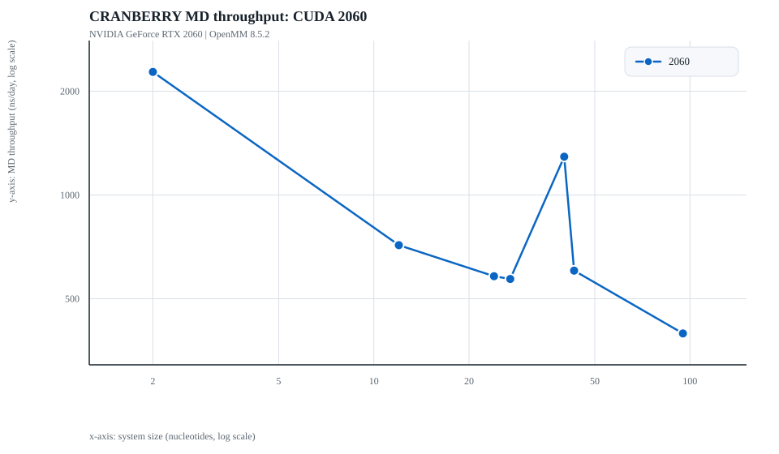

# CRANBERRY Benchmark Snapshot

This page is generated from the latest published benchmark JSON snapshot. The x-axis is system size measured in nucleotides on a log scale, and the y-axis is MD throughput in ns/day on a log scale.

- Source JSON: `nvidia-geforce-rtx-2060.json`
- Benchmark kind: `md-single-system-suite`
- Generated at: `2026-07-08T21:17:19.546056+00:00`
- Platform: `CUDA`
- MPS enabled: `False`
- Series: `nvidia-geforce-rtx-2060`
- Timed steps per system: `1000`
- Warm-up steps per system: `10`
- Timestep: `5.0 fs`
- Model: `default`
- Temperature: `298.0 K`
- Salt: `150.0 mM`
- Cranberry: `1.0.0a1`
- OpenMM: `8.5.2`
- GPU: `NVIDIA GeForce RTX 2060`
- Card label: `2060`
- Driver: `595.71.05`
- CUDA_VISIBLE_DEVICES: `n/a`

## Results

| System | Nucleotides | Atoms | Wall seconds | ns/day |
| --- | ---: | ---: | ---: | ---: |
| `2ntCG` | 2 | 15 | 0.190 | 2276.27 |
| `1zih` | 12 | 95 | 0.604 | 715.47 |
| `157d` | 24 | 190 | 0.743 | 581.49 |
| `1l2x` | 27 | 216 | 0.757 | 570.80 |
| `rU40` | 40 | 319 | 0.335 | 1291.47 |
| `2mi0` | 43 | 342 | 0.716 | 603.54 |
| `5ml7` | 95 | 760 | 1.089 | 396.62 |

## Notes

This first published slice is MD for one GPU and one process. Multi-process MPS comparisons and REMD should be added later as distinct benchmark series.
