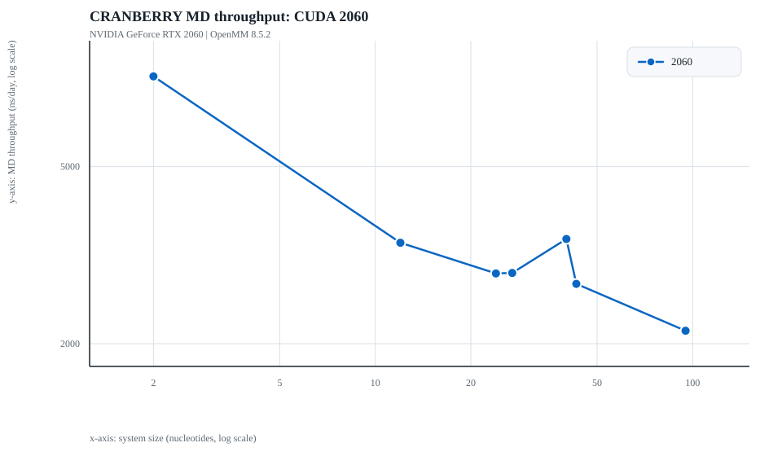

# CRANBERRY Benchmark Snapshot

This page is generated from the latest published benchmark JSON snapshot. The x-axis is system size measured in nucleotides on a log scale, and the y-axis is MD throughput in ns/day on a log scale.

- Source JSON: `nvidia-geforce-rtx-2060.json`
- Benchmark kind: `md-single-system-suite`
- Generated at: `2026-09-06T00:58:17.869780+00:00`
- Platform: `CUDA`
- MPS enabled: `False`
- Series: `nvidia-geforce-rtx-2060`
- Timed steps per system: `1000`
- Warm-up steps per system: `10`
- Timestep: `5.0 fs`
- Model: `default`
- Temperature: `298.0 K`
- Salt: `150.0 mM`
- Cranberry: `1.0.0a1`
- OpenMM: `8.5.2`
- GPU: `NVIDIA GeForce RTX 2060`
- Card label: `2060`
- Driver: `595.84`
- CUDA_VISIBLE_DEVICES: `n/a`

## Results

| System | Nucleotides | Atoms | Wall seconds | ns/day |
| --- | ---: | ---: | ---: | ---: |
| `2ntCG` | 2 | 15 | 0.054 | 7967.09 |
| `1zih` | 12 | 95 | 0.128 | 3370.32 |
| `157d` | 24 | 190 | 0.150 | 2875.54 |
| `1l2x` | 27 | 216 | 0.150 | 2882.87 |
| `rU40` | 40 | 319 | 0.126 | 3435.94 |
| `2mi0` | 43 | 342 | 0.158 | 2725.57 |
| `5ml7` | 95 | 760 | 0.202 | 2137.88 |

## Notes

This first published slice is MD for one GPU and one process. Multi-process MPS comparisons and REMD should be added later as distinct benchmark series.
